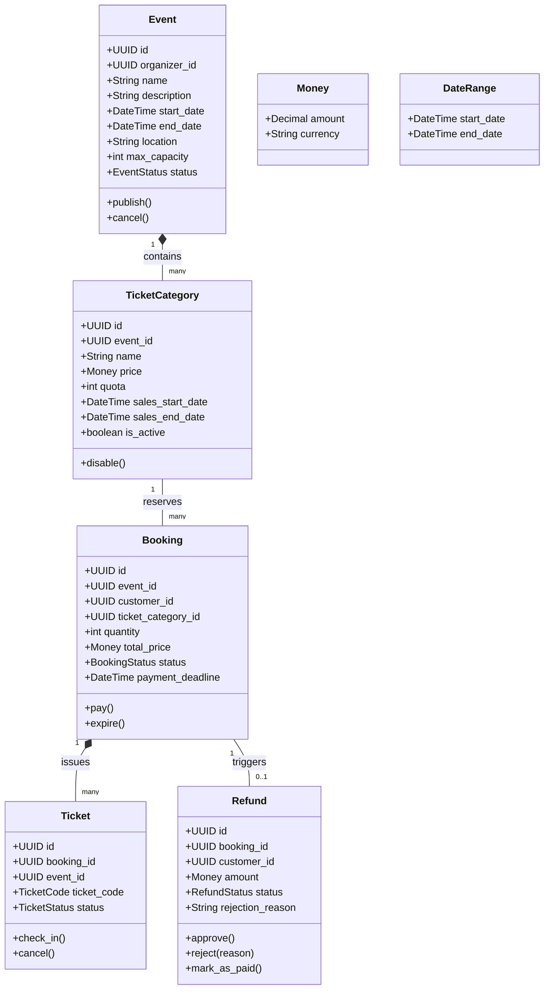

````md
# Documentation

## 1. Ubiquitous Language Glossary

### Event Management

| Term                | Meaning                                                                |
| :------------------ | :--------------------------------------------------------------------- |
| **Event**           | An activity organized by an Event Organizer and attended by customers. |
| **Event Organizer** | A user who creates and manages events.                                 |
| **Draft**           | Initial event status before publication.                               |
| **Published**       | Event status indicating the event is publicly available for booking.   |
| **Cancelled**       | Event status indicating the event is no longer active.                 |
| **Completed**       | Event status indicating the event has finished.                        |

### Ticket Category Management

| Term                | Meaning                                                       |
| :------------------ | :------------------------------------------------------------ |
| **Ticket Category** | A type of ticket such as Regular, VIP, or Early Bird.         |
| **Quota**           | The maximum number of tickets available in a ticket category. |
| **Sales Period**    | The period during which a ticket category can be purchased.   |
| **Active Category** | A ticket category currently available for booking.            |

### Booking & Payment

| Term                 | Meaning                                                           |
| :------------------- | :---------------------------------------------------------------- |
| **Customer**         | A user who books and purchases tickets.                           |
| **Booking**          | A temporary reservation before payment is completed.              |
| **Money**            | A value object representing an amount and currency.               |
| **Payment Deadline** | The deadline for completing payment after a booking is created.   |
| **Pending Payment**  | A booking status indicating payment has not been completed.       |
| **Paid**             | A booking status indicating payment has been completed.           |
| **Expired**          | A booking status indicating the payment deadline has passed.      |
| **Payment Gateway**  | External service responsible for processing customer payments.    |

### Ticket & Check-in

| Term             | Meaning                                                                       |
| :--------------- | :---------------------------------------------------------------------------- |
| **Ticket**       | Proof of attendance generated after a booking is paid.                        |
| **Ticket Code**  | A unique code used to identify and validate a ticket.                         |
| **Check-in**     | The process of validating a ticket when a participant enters the venue.       |
| **Gate Officer** | A user responsible for validating tickets during event check-in.              |

### Refund Management

| Term                    | Meaning                                                        |
| :---------------------- | :------------------------------------------------------------- |
| **Refund**              | The process of returning money to a customer.                  |
| **Refund Request**      | A customer request asking for money to be returned.            |
| **Approved Refund**     | A refund request accepted by the organizer or system.          |
| **Rejected Refund**     | A refund request denied by the organizer or system.            |
| **Refund Payment Service** | External service responsible for processing refund payments. |

---

## 2. Initial Business Rules

### Event Rules

- An event cannot be created if the end date is earlier than the start date.
- An event cannot be created if the maximum capacity is less than or equal to zero.
- A newly created event must have the status `Draft`.
- An event can only be published if it has at least one active ticket category.
- An event can only be published if the total ticket quota does not exceed the maximum event capacity.
- An event with the status `Completed` cannot be cancelled.

### Ticket Category Rules

- The ticket price cannot be less than zero.
- The ticket quota must be greater than zero.
- The ticket sales period must end before or at the event start date.
- An inactive ticket category cannot be booked.

### Booking Rules

- A booking can only be created for an event with the status `Published`.
- A booking can only be created within an active ticket category sales period.
- The ticket quantity must be greater than zero.
- The ticket quantity must not exceed the remaining ticket quota.
- A customer cannot have more than one active booking for the same event.
- The total booking price is calculated from ticket unit price multiplied by ticket quantity and additional service fees.
- The total booking price cannot be negative.
- A booking that exceeds the payment deadline automatically becomes `Expired`.
- A paid booking automatically generates tickets.

### Ticket Rules

- A ticket can only be checked in once.
- A cancelled ticket cannot be checked in.
- Ticket validation must use a unique ticket code.

### Refund Rules

- A refund can only be requested for a paid booking.
- A refund request cannot exceed the original booking payment amount.
- A rejected refund must contain a rejection reason.
- A refund marked as paid cannot be modified again.

---

## 3. Initial Domain Model Draft



---

## 4. Project Structure

```text
src/
├── domain/                              # Core business rules and domain models
│   ├── shared/
│   │   ├── interfaces/
│   │   └── value_objects/
│   ├── event/
│   │   ├── entities/
│   │   ├── events/
│   │   └── repositories/
│   ├── booking/
│   │   ├── entities/
│   │   ├── events/
│   │   └── repositories/
│   └── refund/
│       ├── events/
│       └── repositories/
│
├── application/                         # Application use cases and orchestration
│   ├── event/
│   ├── booking/
│   ├── ticket/
│   ├── refund/
│   └── shared/
│
├── infrastructure/                      # Database and external service implementations
│   ├── database/
│   │   ├── repositories/
│   │   └── migrations/
│   └── services/
│       ├── payment/
│       ├── notification/
│       └── refund/
│
├── presentation/                        # HTTP layer using FastAPI
│   └── http/
│       ├── controllers/
│       ├── routers/
│       ├── middleware/
│       └── dtos/
│
├── tests/                               # Unit and integration tests
│   └── domain/
│
└── docs/                                # Project documentation
```

---

## 5. Layer Responsibilities

### Domain Layer

Responsible for core business rules and domain modeling.

Contains:
- Aggregate roots
- Entities
- Value objects
- Domain events
- Repository interfaces

Characteristics:
- Pure Python only
- No FastAPI dependency
- No database dependency
- No external service dependency

### Application Layer

Responsible for application use cases and business workflow orchestration.

Contains:
- Commands
- Queries
- Handlers
- DTOs
- External service interfaces

Responsibilities:
- Coordinate domain operations
- Execute use cases
- Handle transaction flow
- Communicate with repositories and external services

### Infrastructure Layer

Responsible for technical implementations and external integrations.

Contains:
- PostgreSQL repository implementations
- Database migrations
- Payment service implementations
- Notification service implementations
- Refund service implementations

Responsibilities:
- Persist data to database
- Connect to external systems
- Implement interfaces defined in Application or Domain layers

### Presentation Layer

Responsible for handling HTTP communication using FastAPI.

Contains:
- API routers
- Controllers
- Middleware
- Request/response DTOs

Responsibilities:
- Receive HTTP requests
- Validate request data
- Delegate business logic to Application layer
- Return HTTP responses

---

## 6. Dependency Rule

```text
Presentation → Application → Domain
Infrastructure → Application / Domain
```

Rules:
- Domain layer must not depend on any external framework.
- Infrastructure implements interfaces defined by Application or Domain layers.
- Dependencies always point inward toward the Domain layer.

---

## 7. Request Flow

### Example: Create Booking

```text
HTTP Request
    ↓
Router
    ↓
Controller
    ↓
CreateBookingHandler
    ↓
Booking Aggregate
    ↓
IBookingRepository
    ↓
PostgreSQL Repository Implementation
    ↓
PostgreSQL Database
```

Example domain event flow:

```text
Booking Paid
    ↓
BookingPaidDomainEvent
    ↓
Notification Service
    ↓
Customer Receives Confirmation
```
````
